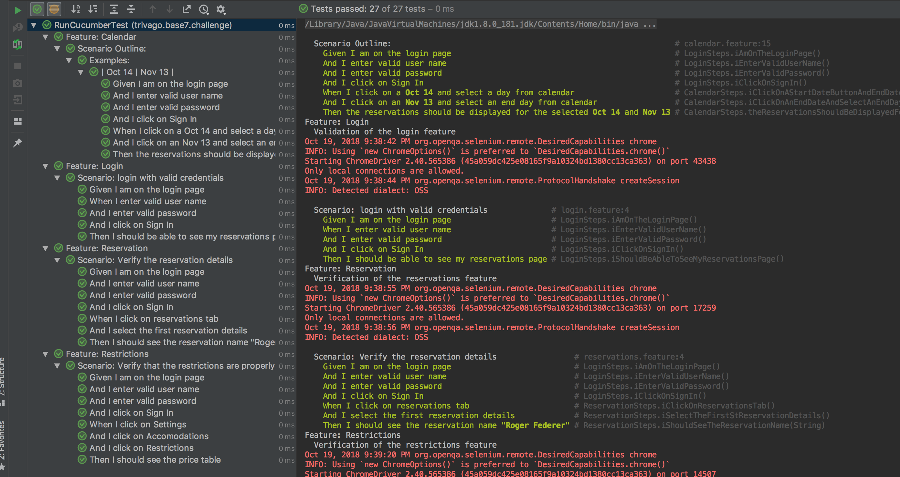

# Base7Challenge

Automation test suite with regression tests for Base7 Beta.

## Getting Started

This is a Maven project with JUnit as the test runner. I have used Cucumber framework for writing BDD scenarios.
 Also I have used IntelliJ as the IDE as it has built in support for writing Java Cucumber features. I have tried Katalon
 Studio and I have experienced the following limitations there. Hence I had chosen IntelliJ to speed up
 the implementation. 
 
 * Doesn't have native support for writing Cucumber step definitions in Java.
 * Provided folder structure is a must to use, doesn't provide the flexibility.
 * Cucumber support has been added very recently, so its prone to a lot of bugs.
 * Struggles to auto format the code or auto generate content to make development faster

### Prerequisites

IntelliJ and Maven

```
Give examples
```

### Installing

Open the project in IntelliJ or your desired IDE and run the following command to execute the tests.

```
mvn clean test
```

Following is an execution output from my local


